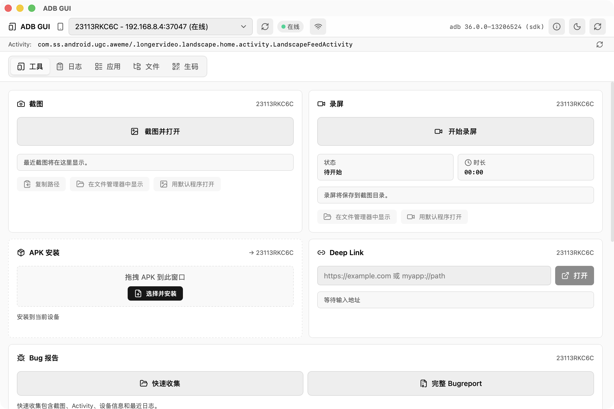

# ADB GUI

**English** | [简体中文](#简体中文)

ADB GUI is a cross-platform desktop toolbox for Android developers and testers. It turns common `adb` workflows into focused visual tools, keeps the selected device visible across the app, and runs device operations locally through a bundled or existing ADB installation.

[Download the latest release](https://github.com/zechuan-start/adb-gui/releases/latest) | [View all releases](https://github.com/zechuan-start/adb-gui/releases)



_The tools workspace with a connected Android device. Device state, current Activity, ADB source, and the active target remain visible while you work._

## Highlights

- **One device context**: automatically discovers USB and Wi-Fi devices, tracks their connection state, and keeps every command scoped to the selected device.
- **Local-first operation**: screenshots, recordings, logs, reports, APKs, and transferred files stay between your computer and Android device.
- **ADB included**: resolves ADB from `PATH`, `ANDROID_HOME`, or `ANDROID_SDK_ROOT`, then falls back to the binary bundled for macOS, Windows, or Linux.
- **Built for repeated debugging**: fast device switching, clear busy/error states, file reveal actions, light/dark themes, and an in-app update checker.

## Features

### Device and connection

- Continuously discovers attached and network devices and shows online, offline, or unauthorized state.
- Connects or disconnects devices by IP address, and can switch the selected USB device to ADB over Wi-Fi.
- Displays the current foreground Activity, ADB version/source, and device details such as model, manufacturer, Android version, SDK, ABI, resolution, density, and battery state.

### Diagnostics and evidence

- Captures a device screenshot, opens it with the default image app, copies its path, or reveals it in the file manager.
- Starts and stops Android `screenrecord`, saves the finalized MP4 locally, and handles device switching or natural recording timeout.
- Streams Logcat with text, level, tag, and app filters; supports pause/follow, device-buffer clearing, and local export.
- Creates a quick report containing a screenshot, current Activity, device information, and recent logs, or generates a complete `adb bugreport` archive.

### Apps and device interaction

- Installs APK files by drag-and-drop or file picker.
- Lists third-party packages with app icons and supports launch, force-stop, clear data, and uninstall actions.
- Opens custom deep links and URIs on the selected device.
- Sends common navigation, input, power, and volume key events.
- Shows the foreground package and provides quick actions for the current app.

### Files and networking

- Browses device directories with breadcrumb and absolute-path navigation.
- Creates folders, uploads one or multiple files, downloads files to a user-selected location, and previews PNG, JPEG, WebP, and GIF images.
- Protects downloads with temporary-file validation and replacement, and avoids silently overwriting existing upload targets.
- Lists, creates, and removes both `adb forward` and `adb reverse` TCP rules.

### Code generation and desktop experience

- Generates QR codes or Code 128 barcodes from one or many input values.
- Splits batches by newline, comma, semicolon, tab, or a custom separator, with virtualized result rendering and full-size preview navigation.
- Supports light and dark themes, native file dialogs, file reveal/open actions, and signed in-app update metadata.

## Platform Support

| Platform | Release architecture | ADB runtime |
| --- | --- | --- |
| macOS | Apple Silicon and Intel | Bundled, SDK, or `PATH` |
| Windows | x64 | Bundled, SDK, or `PATH`; background ADB commands do not open console windows |
| Linux | x64 | Bundled, SDK, or `PATH` |

Every release tag is packaged by GitHub Actions on native macOS, Windows, and Linux runners.

## Getting Started

1. Download the package for your platform from [GitHub Releases](https://github.com/zechuan-start/adb-gui/releases/latest).
2. Enable Developer options and USB debugging on the Android device.
3. Connect the device and approve the computer's debugging fingerprint when Android prompts you.
4. Open ADB GUI and select the device from the top bar. A separate Platform Tools installation is optional because ADB is bundled.

For Wi-Fi debugging, connect the device over USB first and use the Wi-Fi action in the top bar, or enter an already reachable `ip:port` endpoint.

## Local Output

| Output | Default location |
| --- | --- |
| Screenshots and screen recordings | `Pictures/ADB GUI/` |
| Quick reports and full bugreports | `Documents/ADB GUI/reports/` |
| Exported Logcat files | `Documents/ADB GUI/logs/` |
| Downloaded device files | Location selected in the save dialog |

## Development

Prerequisites: [Node.js](https://nodejs.org/), [pnpm](https://pnpm.io/), [Rust](https://www.rust-lang.org/tools/install), and the platform-specific [Tauri prerequisites](https://tauri.app/start/prerequisites/).

```bash
pnpm install
pnpm test
pnpm tauri dev
```

Main stack:

- **Desktop**: Tauri 2, Rust, Tokio
- **Frontend**: React 19, TypeScript, Vite, Tailwind CSS, Zustand
- **Device bridge**: Android Debug Bridge, using the system/SDK binary when available and the bundled binary otherwise

Recommended editor setup: [VS Code](https://code.visualstudio.com/) with the [Tauri extension](https://marketplace.visualstudio.com/items?itemName=tauri-apps.tauri-vscode) and [rust-analyzer](https://marketplace.visualstudio.com/items?itemName=rust-lang.rust-analyzer).

## Packaging and Releases

- Run the `Package` workflow manually to build downloadable workflow artifacts without publishing a release.
- Push a `v*` tag, such as `v0.1.3`, to create the release, build all four platform targets, attach installers and updater artifacts, and publish only after every package job succeeds.
- Updater artifacts require `plugins.updater.pubkey` plus the `TAURI_SIGNING_PRIVATE_KEY` and `TAURI_SIGNING_PRIVATE_KEY_PASSWORD` repository secrets.

---

## 简体中文

[English](#adb-gui) | **简体中文**

ADB GUI 是一款面向 Android 开发与测试场景的跨平台桌面工具. 它把常用 `adb` 工作流整理成可视化工具, 在整个应用中保持当前设备上下文, 并通过系统、SDK 或应用内置的 ADB 在本机完成设备操作.

[下载最新版本](https://github.com/zechuan-start/adb-gui/releases/latest) | [查看全部版本](https://github.com/zechuan-start/adb-gui/releases)


_已连接 Android 设备时的工具工作区. 设备状态、当前 Activity、ADB 来源和操作目标始终显示在窗口顶部._

## 核心特点

- **统一设备上下文**: 自动发现 USB 和 Wi-Fi 设备, 跟踪连接状态, 所有命令都明确作用于当前选中的设备.
- **本地完成操作**: 截图、录屏、日志、报告、APK 和传输文件只在电脑与 Android 设备之间流转.
- **内置 ADB**: 优先从 `PATH`、`ANDROID_HOME` 或 `ANDROID_SDK_ROOT` 查找 ADB, 找不到时自动使用 macOS、Windows 或 Linux 对应的内置版本.
- **适合反复调试**: 支持快速切换设备、明确的忙碌与错误状态、文件打开与定位、明暗主题和应用内更新检查.

## 功能介绍

### 设备与连接

- 持续发现 USB 和网络设备, 显示在线、离线或未授权状态.
- 支持通过 IP 连接或断开设备, 也可以把当前 USB 设备切换到 ADB Wi-Fi 模式.
- 显示当前前台 Activity、ADB 版本与来源, 并可查看型号、厂商、Android 版本、SDK、ABI、分辨率、密度、电量等设备信息.

### 诊断与证据收集

- 一键截取设备屏幕, 自动保存并打开图片, 同时支持复制路径或在文件管理器中定位.
- 启动和停止 Android `screenrecord`, 将完成写入的 MP4 保存到本地, 并处理切换设备和录制自然结束的状态.
- 实时查看 Logcat, 支持文本、级别、Tag 和应用过滤, 以及暂停跟随、清理设备日志缓冲区和导出日志.
- 快速报告会收集截图、当前 Activity、设备信息和最近日志; 完整报告则生成标准 `adb bugreport` 压缩包.

### 应用与设备交互

- 通过拖拽或文件选择器安装 APK.
- 显示第三方应用列表和图标, 支持启动、强制停止、清除数据与卸载.
- 在当前设备上打开自定义 Deep Link 或 URI.
- 发送导航、输入、电源、音量等常用按键事件.
- 识别当前前台应用, 并提供常用应用操作入口.

### 文件与网络

- 通过面包屑和绝对路径浏览设备目录.
- 支持新建目录、单文件或多文件上传、下载到用户指定位置, 以及预览 PNG、JPEG、WebP、GIF 图片.
- 下载使用临时文件校验后再替换目标, 上传时避免静默覆盖设备上的同名文件.
- 查看、新建和删除 `adb forward` 与 `adb reverse` TCP 端口规则.

### 生码与桌面体验

- 根据单条或批量数据生成二维码和 Code 128 条形码.
- 支持换行、逗号、分号、Tab 或自定义分隔符, 大批量结果使用虚拟列表渲染, 并支持全尺寸预览切换.
- 支持明暗主题、原生文件对话框、文件打开与定位, 以及带签名元数据的应用内更新.

## 平台支持

| 平台 | 发布架构 | ADB 运行方式 |
| --- | --- | --- |
| macOS | Apple Silicon 和 Intel | 内置、SDK 或 `PATH` |
| Windows | x64 | 内置、SDK 或 `PATH`; 后台 ADB 命令不会弹出终端窗口 |
| Linux | x64 | 内置、SDK 或 `PATH` |

每个正式版本标签都会由 GitHub Actions 在原生 macOS、Windows 和 Linux runner 上完成打包.

## 快速开始

1. 从 [GitHub Releases](https://github.com/zechuan-start/adb-gui/releases/latest) 下载对应平台的安装包.
2. 在 Android 设备上启用开发者选项和 USB 调试.
3. 连接设备, 并在 Android 弹窗中允许当前电脑的调试指纹.
4. 打开 ADB GUI, 从顶部选择设备. 应用已内置 ADB, 因此不强制要求单独安装 Platform Tools.

使用 Wi-Fi 调试时, 可以先通过 USB 连接并使用顶部的 Wi-Fi 操作, 也可以直接输入已经可访问的 `ip:port` 地址.

## 本地文件位置

| 内容 | 默认位置 |
| --- | --- |
| 截图和屏幕录制 | `Pictures/ADB GUI/` |
| 快速报告和完整 Bugreport | `Documents/ADB GUI/reports/` |
| 导出的 Logcat 日志 | `Documents/ADB GUI/logs/` |
| 从设备下载的文件 | 保存对话框中选择的位置 |

## 本地开发

前置依赖: [Node.js](https://nodejs.org/)、[pnpm](https://pnpm.io/)、[Rust](https://www.rust-lang.org/tools/install), 以及对应平台的 [Tauri 环境依赖](https://tauri.app/start/prerequisites/).

```bash
pnpm install
pnpm test
pnpm tauri dev
```

主要技术栈:

- **桌面端**: Tauri 2、Rust、Tokio
- **前端**: React 19、TypeScript、Vite、Tailwind CSS、Zustand
- **设备桥接**: Android Debug Bridge, 优先使用系统或 SDK 中的 ADB, 否则使用应用内置版本

推荐使用 [VS Code](https://code.visualstudio.com/), 并安装 [Tauri 扩展](https://marketplace.visualstudio.com/items?itemName=tauri-apps.tauri-vscode) 和 [rust-analyzer](https://marketplace.visualstudio.com/items?itemName=rust-lang.rust-analyzer).

## 打包与发布

- 手动运行 `Package` workflow 可以构建供下载的 workflow artifacts, 但不会发布正式版本.
- 推送形如 `v0.1.3` 的 `v*` 标签后, CI 会创建 Release, 构建四个平台目标, 上传安装包与更新产物, 并且只在全部打包任务成功后正式发布.
- 自动更新产物需要配置 `plugins.updater.pubkey`, 以及仓库 Secrets `TAURI_SIGNING_PRIVATE_KEY` 和 `TAURI_SIGNING_PRIVATE_KEY_PASSWORD`.
