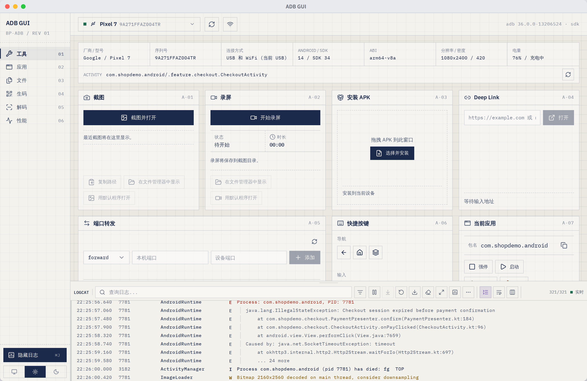
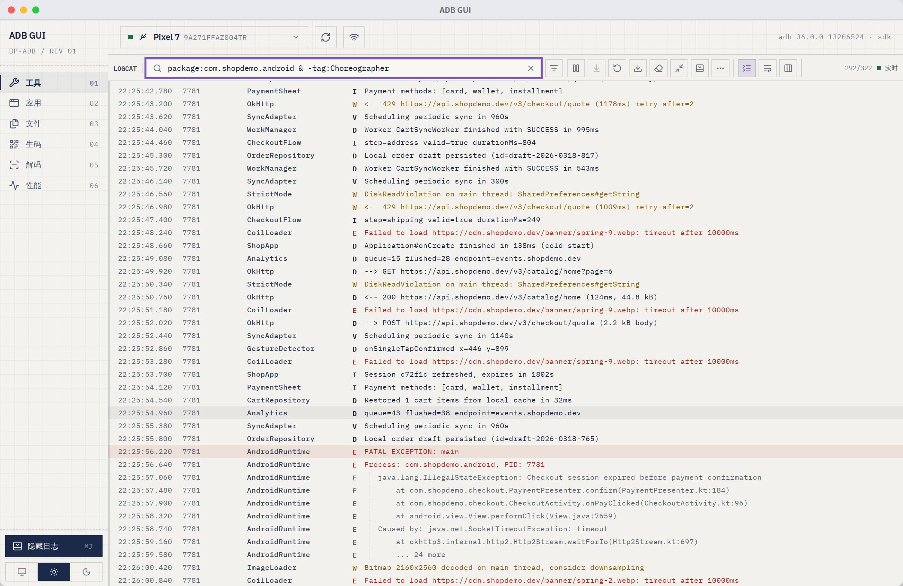
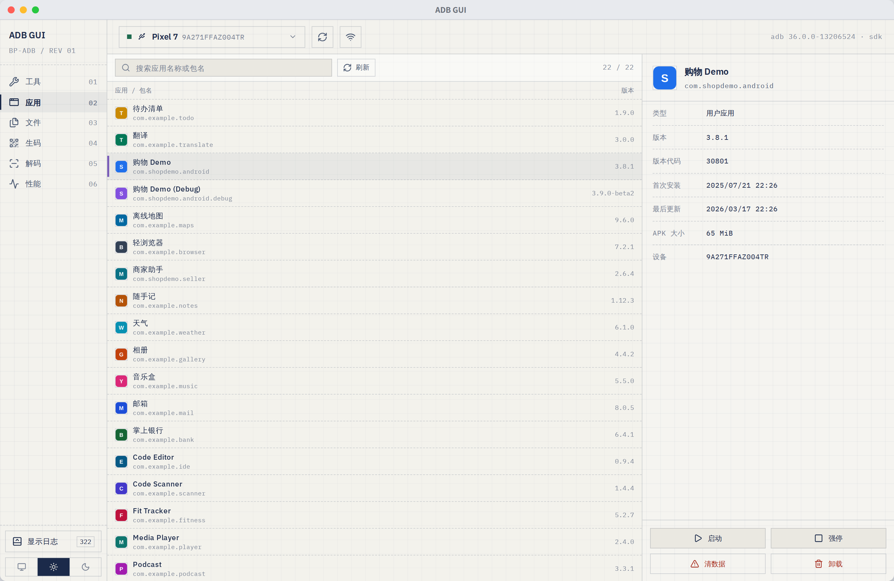
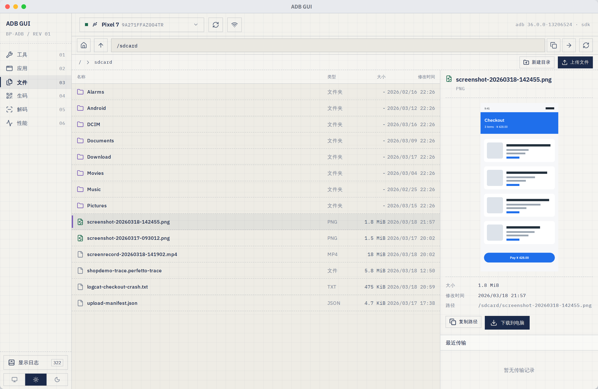
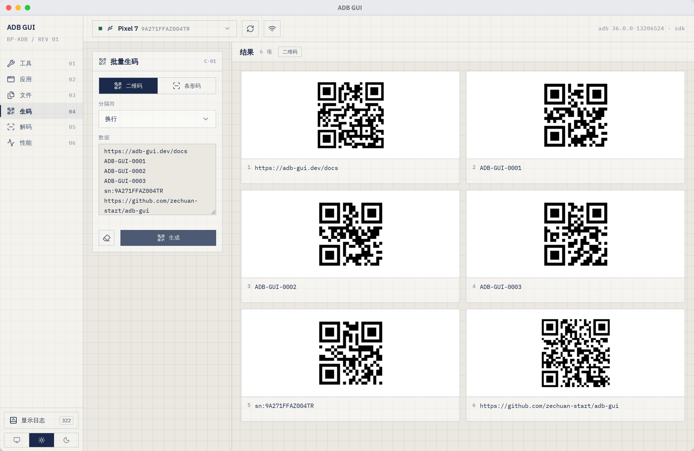
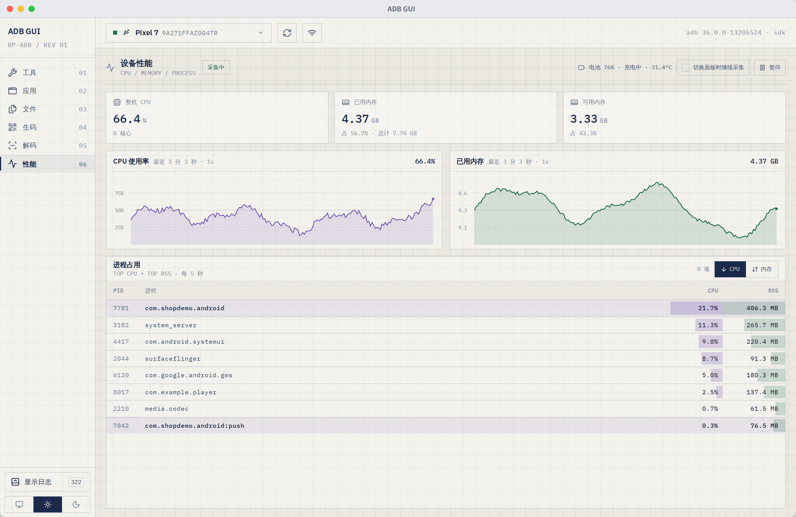
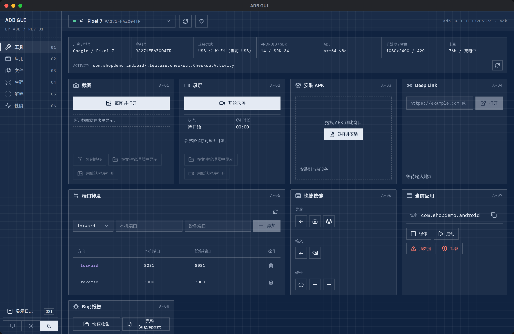

# ADB GUI

**English** | [简体中文](#简体中文)

A cross-platform desktop workbench for everyday `adb` work: one device context, six focused workspaces, and a Logcat panel that stays with you wherever you are in the app.

[](https://github.com/zechuan-start/adb-gui/releases/latest)
[](LICENSE)


[Download the latest release](https://github.com/zechuan-start/adb-gui/releases/latest) · [All releases](https://github.com/zechuan-start/adb-gui/releases)



> The application interface ships in Simplified Chinese. Screenshots in this README are captured from the real UI with mock device data (see [Development](#development)).

## Highlights

- **One device context** — USB and Wi-Fi transports of the same phone are merged into a single entry, and every command in every workspace targets the device you picked in the top bar.
- **Logcat everywhere** — the log panel docks under any workspace, remembers whether it was open per workspace, is resizable, and can go full height when you need to read a stack trace.
- **Local-first** — screenshots, recordings, logs, reports, APKs, and transferred files stay between your computer and your device. Nothing is uploaded.
- **ADB included** — resolved from `PATH`, `ANDROID_HOME`, or `ANDROID_SDK_ROOT`, with a bundled binary as a fallback, so a separate Platform Tools install is optional.

## Workspaces

| # | Workspace | What it covers |
| --- | --- | --- |
| 01 | Tools | Screenshot, screen recording, APK install, deep links, port forwarding, key events, current app, bug reports |
| 02 | Apps | Third-party package list with icons, versions, install dates, APK size, and lifecycle actions |
| 03 | Files | Device file browser with upload, download, folder creation, and image preview |
| 04 | Codegen | Batch QR code and Code 128 barcode generation |
| 05 | Decoder | Read codes back out of image files, drag-and-drop, or a pasted screenshot |
| 06 | Performance | Live CPU, memory, battery, and per-process usage |
| — | Logcat | Streaming log panel with a query language, shared by every workspace |

## Features

### Device and connection

- Continuously discovers attached and network devices and shows online, offline, or unauthorized state.
- Merges the USB and Wi-Fi transports of one physical device, so switching cables never loses your place.
- Connects or disconnects by `ip:port`, and can flip the selected USB device over to ADB over Wi-Fi.
- Shows the ADB version and source in the top bar, plus a specification strip with vendor/model, serial, transport, Android version and SDK, ABI, resolution, density, and battery, with the current foreground Activity on its own row.

### Logcat



- Streams Logcat live, with pause/resume, follow-to-bottom, clear screen, clear the device buffer, and export of the current filtered result.
- Filters through a small query language: `tag:`, `message:`, `level:`, `package:`, `process:`, and `is:crash` / `is:stacktrace`, combined with `&`, `|`, `-`, and parentheses, with regex or exact-match modifiers and inline completions.
- Detects crashes and stack traces, highlights them, and can auto-fold long traces so one crash stays one line until you open it.
- Adjustable view: which columns to show, soft wrap, wide line spacing, and a full-height mode.
- The panel keeps a per-workspace open state and shows an unread counter while it is hidden.

### Apps



- Lists third-party packages with real launcher icons, display names, version name and code, first install and last update time, and APK size.
- Search by app name or package name, then launch, force-stop, clear data, or uninstall the selected package.
- Icons and app metadata are cached per device, so reopening the workspace is fast.

### Files



- Browses device directories with breadcrumbs and absolute-path navigation.
- Creates folders, uploads one or many files, and downloads to a location you choose.
- Previews PNG, JPEG, WebP, and GIF images inline.
- Downloads are written through a validated temporary file before replacing the target, and uploads never silently overwrite an existing file on the device.

### Codegen and decoder



- Generates QR codes or Code 128 barcodes from one value or a whole batch (Ctrl/Cmd+Enter to generate).
- Splits input by newline, comma, semicolon, tab, or a custom separator, renders large batches through a virtualized list, and offers full-size preview navigation.
- Decodes codes back from PNG, JPG, JPEG, GIF, BMP, and WebP files — picked, dragged into the window, or pasted from the clipboard (Ctrl/Cmd+V) — up to 50 images at a time, with copy and open-link actions on the results.

### Performance



- Samples whole-device CPU, used and available memory, and battery level, status, and temperature once per second.
- Draws CPU and memory history as charts with a hover readout, and keeps up to 30 minutes of samples.
- Ranks processes by CPU or RSS, and marks processes that appeared during the session.
- Can pause on demand, or keep sampling in the background while you work in another workspace.

### Desktop experience



- System, light, and dark themes.
- Native file dialogs, plus reveal-in-file-manager and open-with-default-app actions for everything the app writes.
- Signed in-app update checks against GitHub releases.

## Keyboard shortcuts

| Shortcut | Action |
| --- | --- |
| `Ctrl/Cmd + J` | Show or hide the Logcat panel for the current workspace |
| `Ctrl/Cmd + F` | Open the Logcat panel and focus the query field |
| `Ctrl/Cmd + Enter` | Generate codes in the Codegen workspace |
| `Ctrl/Cmd + V` | Decode the image on the clipboard in the Decoder workspace |

## Platform support

| Platform | Release architecture | ADB runtime |
| --- | --- | --- |
| macOS | Apple Silicon and Intel | Bundled, SDK, or `PATH` |
| Windows | x64 | Bundled, SDK, or `PATH`; background ADB commands do not open console windows |
| Linux | x64 | Bundled, SDK, or `PATH` |

Every release tag is packaged by GitHub Actions on native macOS, Windows, and Linux runners.

## Getting started

1. Download the package for your platform from [GitHub Releases](https://github.com/zechuan-start/adb-gui/releases/latest).
2. Enable Developer options and USB debugging on the Android device.
3. Connect the device and approve the computer's debugging fingerprint when Android prompts you.
4. Open ADB GUI and select the device in the top bar. A separate Platform Tools installation is optional because ADB is bundled.

For Wi-Fi debugging, connect over USB first and use the Wi-Fi action in the top bar, or enter an already reachable `ip:port` endpoint.

## Where files land

| Output | Default location |
| --- | --- |
| Screenshots and screen recordings | `Pictures/ADB GUI/` |
| Quick reports and full bugreports | `Documents/ADB GUI/reports/` |
| Exported Logcat files | `Documents/ADB GUI/logs/` |
| Downloaded device files | The location you pick in the save dialog |

## Development

Prerequisites: [Node.js](https://nodejs.org/), [pnpm](https://pnpm.io/), [Rust](https://www.rust-lang.org/tools/install), and the platform-specific [Tauri prerequisites](https://tauri.app/start/prerequisites/).

```bash
pnpm install
pnpm test        # vitest
pnpm tauri dev   # run the desktop app
```

Main stack:

- **Desktop**: Tauri 2, Rust, Tokio
- **Frontend**: React 19, TypeScript, Vite, Tailwind CSS, Zustand
- **Device bridge**: Android Debug Bridge, using the system or SDK binary when available and the bundled binary otherwise

Documentation screenshots are generated, not taken by hand:

```bash
pnpm screenshots
```

`scripts/screenshots/capture.mjs` starts the dev server, loads the real frontend in Chromium with the fake IPC layer in `scripts/screenshots/mock-tauri.js`, and rewrites the images in `docs/images/`. The mock data is deterministic, so re-running it only changes what actually changed in the UI. It needs Playwright and its Chromium build (`npm i -g playwright && npx playwright install chromium` if you do not already have them).

Recommended editor setup: [VS Code](https://code.visualstudio.com/) with the [Tauri extension](https://marketplace.visualstudio.com/items?itemName=tauri-apps.tauri-vscode) and [rust-analyzer](https://marketplace.visualstudio.com/items?itemName=rust-lang.rust-analyzer).

## Packaging and releases

- Run the `Package` workflow manually to build downloadable workflow artifacts without publishing a release.
- Push a `v*` tag, such as `v0.1.8`, to create the release, build all platform targets, attach installers and updater artifacts, and publish only after every package job succeeds.
- Updater artifacts require `plugins.updater.pubkey` plus the `TAURI_SIGNING_PRIVATE_KEY` and `TAURI_SIGNING_PRIVATE_KEY_PASSWORD` repository secrets.

## License

[MIT](LICENSE)

---

## 简体中文

[English](#adb-gui) | **简体中文**

面向日常 `adb` 工作的跨平台桌面工作台: 统一的设备上下文, 六个各司其职的工作区, 以及一个跟着你走的 Logcat 面板.

[下载最新版本](https://github.com/zechuan-start/adb-gui/releases/latest) · [查看全部版本](https://github.com/zechuan-start/adb-gui/releases)


> README 中的截图由真实界面加模拟设备数据自动生成, 生成方式见 [本地开发](#本地开发).

## 核心特点

- **统一设备上下文** — 同一台手机的 USB 和 Wi-Fi 通道会合并成一个条目, 所有工作区的每条命令都作用于顶栏选中的设备.
- **日志随处可用** — 日志面板停靠在任意工作区下方, 分工作区记住开合状态, 高度可拖拽, 需要看堆栈时可以铺满窗口.
- **本地完成操作** — 截图、录屏、日志、报告、APK 和传输文件只在电脑与设备之间流转, 不上传任何数据.
- **内置 ADB** — 优先使用 `PATH`、`ANDROID_HOME` 或 `ANDROID_SDK_ROOT` 中的 ADB, 找不到时回落到内置版本, 因此不强制单独安装 Platform Tools.

## 工作区

| # | 工作区 | 覆盖内容 |
| --- | --- | --- |
| 01 | 工具 | 截图、录屏、安装 APK、Deep Link、端口转发、快捷按键、当前应用、Bug 报告 |
| 02 | 应用 | 第三方应用列表, 含图标、版本、安装时间、APK 大小和常用操作 |
| 03 | 文件 | 设备文件浏览, 支持上传、下载、新建目录和图片预览 |
| 04 | 生码 | 批量生成二维码和 Code 128 条形码 |
| 05 | 解码 | 从图片文件、拖拽或剪贴板截图中反向解码 |
| 06 | 性能 | 实时 CPU、内存、电池和进程占用 |
| — | 日志 | 带查询语法的实时 Logcat 面板, 所有工作区共用 |

## 功能介绍

### 设备与连接

- 持续发现 USB 和网络设备, 显示在线、离线或未授权状态.
- 合并同一台物理设备的 USB 与 Wi-Fi 通道, 换线切换不会丢失当前上下文.
- 支持按 `ip:port` 连接或断开, 也可以把当前 USB 设备切换到 ADB Wi-Fi 模式.
- 顶栏显示 ADB 版本与来源; 设备信息条平铺厂商与型号、序列号、连接方式、Android 版本与 SDK、ABI、分辨率、密度、电量, 并用单独一行显示当前前台 Activity.

### 日志


- 实时查看 Logcat, 支持暂停与恢复、回到底部跟随、清屏、清空设备日志缓冲区, 以及导出当前过滤结果.
- 使用查询语法过滤: `tag:`、`message:`、`level:`、`package:`、`process:`、`is:crash` / `is:stacktrace`, 可用 `&`、`|`、`-` 和括号组合, 并支持正则与精确匹配修饰符和输入补全.
- 自动识别崩溃与堆栈并高亮, 可自动折叠长堆栈, 让一次崩溃在展开前只占一行.
- 视图可调: 显示哪些列、Soft-Wrap、宽行距, 以及铺满窗口模式.
- 面板按工作区记住开合状态, 隐藏时在侧栏显示未读条数.

### 应用


- 显示第三方应用列表, 含真实图标、应用名、版本名与版本号、首次安装与最后更新时间、APK 大小.
- 支持按应用名或包名搜索, 并对选中应用执行启动、强制停止、清除数据、卸载.
- 图标与应用信息按设备缓存, 再次进入工作区时加载更快.

### 文件


- 通过面包屑和绝对路径浏览设备目录.
- 支持新建目录、单文件或多文件上传, 以及下载到自选位置.
- 可直接预览 PNG、JPEG、WebP、GIF 图片.
- 下载先写入临时文件并校验后再替换目标, 上传时不会静默覆盖设备上的同名文件.

### 生码与解码


- 根据单条或批量数据生成二维码和 Code 128 条形码 (Ctrl/Cmd+Enter 生成).
- 支持换行、逗号、分号、Tab 或自定义分隔符; 大批量结果使用虚拟列表渲染, 并支持全尺寸预览切换.
- 可从 PNG、JPG、JPEG、GIF、BMP、WebP 图片反向解码 — 选择文件、拖入窗口或从剪贴板粘贴 (Ctrl/Cmd+V), 单次最多 50 张, 结果支持复制和打开链接.

### 性能


- 每秒采集整机 CPU、已用与可用内存, 以及电池电量、状态和温度.
- 用带悬停读数的折线图展示 CPU 与内存历史, 最多保留约 30 分钟样本.
- 按 CPU 或 RSS 排序进程占用, 并标记采集期间新出现的进程.
- 支持随时暂停, 也可以在切换到其他工作区后继续后台采集.

### 桌面体验


- 跟随系统、亮色、暗色三种主题.
- 原生文件对话框, 应用写出的文件都支持"在文件管理器中显示"和"用默认程序打开".
- 基于 GitHub Release 的带签名应用内更新检查.

## 快捷键

| 快捷键 | 作用 |
| --- | --- |
| `Ctrl/Cmd + J` | 显示或隐藏当前工作区的日志面板 |
| `Ctrl/Cmd + F` | 打开日志面板并聚焦查询输入框 |
| `Ctrl/Cmd + Enter` | 在生码工作区生成结果 |
| `Ctrl/Cmd + V` | 在解码工作区解码剪贴板中的图片 |

## 平台支持

| 平台 | 发布架构 | ADB 运行方式 |
| --- | --- | --- |
| macOS | Apple Silicon 和 Intel | 内置、SDK 或 `PATH` |
| Windows | x64 | 内置、SDK 或 `PATH`; 后台 ADB 命令不会弹出终端窗口 |
| Linux | x64 | 内置、SDK 或 `PATH` |

每个正式版本标签都会由 GitHub Actions 在原生 macOS、Windows 和 Linux runner 上完成打包.

## 快速开始

1. 从 [GitHub Releases](https://github.com/zechuan-start/adb-gui/releases/latest) 下载对应平台的安装包.
2. 在 Android 设备上启用开发者选项和 USB 调试.
3. 连接设备, 并在 Android 弹窗中允许当前电脑的调试指纹.
4. 打开 ADB GUI, 从顶部选择设备. 应用已内置 ADB, 因此不强制要求单独安装 Platform Tools.

使用 Wi-Fi 调试时, 可以先通过 USB 连接并使用顶部的 Wi-Fi 操作, 也可以直接输入已经可访问的 `ip:port` 地址.

## 本地文件位置

| 内容 | 默认位置 |
| --- | --- |
| 截图和屏幕录制 | `Pictures/ADB GUI/` |
| 快速报告和完整 Bugreport | `Documents/ADB GUI/reports/` |
| 导出的 Logcat 日志 | `Documents/ADB GUI/logs/` |
| 从设备下载的文件 | 保存对话框中选择的位置 |

## 本地开发

前置依赖: [Node.js](https://nodejs.org/)、[pnpm](https://pnpm.io/)、[Rust](https://www.rust-lang.org/tools/install), 以及对应平台的 [Tauri 环境依赖](https://tauri.app/start/prerequisites/).

```bash
pnpm install
pnpm test        # vitest
pnpm tauri dev   # 启动桌面应用
```

主要技术栈:

- **桌面端**: Tauri 2、Rust、Tokio
- **前端**: React 19、TypeScript、Vite、Tailwind CSS、Zustand
- **设备桥接**: Android Debug Bridge, 优先使用系统或 SDK 中的 ADB, 否则使用应用内置版本

文档截图由脚本生成, 不需要手动截屏:

```bash
pnpm screenshots
```

`scripts/screenshots/capture.mjs` 会启动开发服务器, 在 Chromium 中加载真实前端, 并注入 `scripts/screenshots/mock-tauri.js` 提供的模拟 IPC 数据, 然后重新生成 `docs/images/` 下的图片. 模拟数据是确定性的, 所以重跑只会反映界面本身的变化. 该脚本依赖 Playwright 及其 Chromium (未安装时执行 `npm i -g playwright && npx playwright install chromium`).

推荐使用 [VS Code](https://code.visualstudio.com/), 并安装 [Tauri 扩展](https://marketplace.visualstudio.com/items?itemName=tauri-apps.tauri-vscode) 和 [rust-analyzer](https://marketplace.visualstudio.com/items?itemName=rust-lang.rust-analyzer).

## 打包与发布

- 手动运行 `Package` workflow 可以构建供下载的 workflow artifacts, 但不会发布正式版本.
- 推送形如 `v0.1.8` 的 `v*` 标签后, CI 会创建 Release, 构建全部平台目标, 上传安装包与更新产物, 并且只在全部打包任务成功后正式发布.
- 自动更新产物需要配置 `plugins.updater.pubkey`, 以及仓库 Secrets `TAURI_SIGNING_PRIVATE_KEY` 和 `TAURI_SIGNING_PRIVATE_KEY_PASSWORD`.

## 许可证

[MIT](LICENSE)
